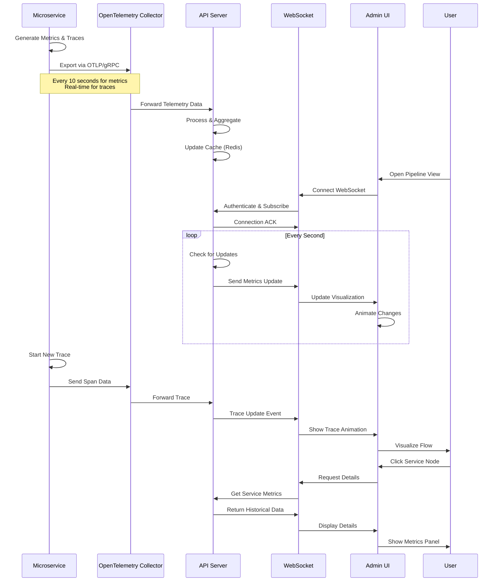

# Pipeline Visualization Data Flow Overview

## Data Flow Diagram



## Data Types and Flow

### 1. Metrics Flow (High Volume)
```
Service → OTLP → Collector → API Server → Aggregation → WebSocket → UI
```
- **Frequency**: Every 10 seconds per service
- **Volume**: ~100 metrics per service
- **Processing**: Aggregated into time-series buckets
- **Delivery**: Batched updates via WebSocket

### 2. Trace Flow (Real-time)
```
Service → OTLP → Collector → API Server → Stream → WebSocket → UI
```
- **Frequency**: Real-time as requests occur
- **Volume**: 1-100 traces per second
- **Processing**: Minimal, mostly pass-through
- **Delivery**: Individual trace events

### 3. Health Status Flow (Periodic)
```
Service → Health Endpoint → API Server → Status Check → WebSocket → UI
```
- **Frequency**: Every 30 seconds
- **Volume**: 1 status per service
- **Processing**: Health score calculation
- **Delivery**: Bundled with metrics

### 4. Alert Flow (Event-driven)
```
API Server → Alert Engine → Evaluation → WebSocket → UI → Toast
```
- **Frequency**: As conditions are met
- **Volume**: 0-10 per minute
- **Processing**: Rule evaluation
- **Delivery**: Priority queue

## Data Transformation Pipeline

### Raw Metrics Example
```json
{
  "resource": {
    "service.name": "web_scraper",
    "service.version": "1.0.0"
  },
  "metrics": [
    {
      "name": "service.request.count",
      "value": 42,
      "timestamp": 1704067200000,
      "attributes": {
        "status": "success"
      }
    }
  ]
}
```

### Transformed for WebSocket
```json
{
  "type": "metrics_update",
  "timestamp": "2025-01-01T00:00:00Z",
  "payload": {
    "service_name": "web_scraper",
    "metrics": {
      "queue_length": 42,
      "avg_latency": 234.5,
      "throughput": 15.3,
      "error_rate": 0.02
    }
  }
}
```

### UI State Update
```typescript
// React State
{
  nodes: [{
    id: "web_scraper",
    data: {
      label: "Web Scraper",
      metrics: {
        queueLength: 42,
        avgLatency: 234.5,
        throughput: 15.3
      },
      status: "processing"
    }
  }]
}
```

## Performance Considerations

### Data Reduction Strategies

1. **Metric Aggregation**
   - Raw: 1000 data points/minute
   - Aggregated: 60 data points/minute
   - Reduction: 94%

2. **Trace Sampling**
   - Full traces: First 10 per minute
   - Sampled: 10% after threshold
   - Error traces: Always included

3. **WebSocket Batching**
   - Individual messages: 100/second
   - Batched: 1/second with 100 updates
   - Network reduction: 99%

### Memory Management

```
┌─────────────────────┐
│   Frontend Memory   │
├─────────────────────┤
│ Current Metrics: 5MB│  ← Only latest values
│ Trace Buffer: 10MB  │  ← Last 100 traces
│ History: 20MB       │  ← 1 hour sliding window
│ UI State: 5MB       │  ← Component state
├─────────────────────┤
│ Total: ~40MB        │
└─────────────────────┘

┌─────────────────────┐
│ API Server Memory   │
├─────────────────────┤
│ Metrics Cache: 100MB│  ← All services, 1 hour
│ Trace Cache: 200MB  │  ← Active traces
│ Connections: 100MB  │  ← 1000 connections
│ Buffers: 200MB      │  ← Message queues
├─────────────────────┤
│ Total: ~600MB       │
└─────────────────────┘
```

## Critical Path Optimization

### Fastest Path (Metrics)
1. Service records metric: 1ms
2. OTLP export: 5ms
3. Collector processing: 2ms
4. API aggregation: 3ms
5. WebSocket send: 2ms
6. UI update: 5ms
**Total: ~18ms**

### Fastest Path (Traces)
1. Span creation: 1ms
2. Context propagation: 1ms
3. OTLP export: 5ms
4. API processing: 2ms
5. WebSocket send: 2ms
6. Animation start: 10ms
**Total: ~21ms**

## Failure Scenarios

### Service Failure
```
Service Down → Health Check Fails → Status Update → 
UI Shows Red → Alert Generated → User Notified
```

### Collector Failure
```
OTLP Export Fails → Local Buffer → Retry Logic →
Exponential Backoff → Circuit Breaker → Fallback Mode
```

### WebSocket Disconnection
```
Connection Lost → UI Shows Offline → Message Queue →
Auto Reconnect → Replay Missed Events → State Sync
```

### API Server Failure
```
Health Check Fails → Load Balancer Redirect →
Backup Server → Session Recovery → Continue Service
```

## Scalability Path

### Horizontal Scaling Points
1. **API Servers**: Load balanced WebSocket connections
2. **Collectors**: Multiple instances with partitioning
3. **Redis**: Cluster mode for cache distribution
4. **Services**: Already horizontally scaled

### Vertical Scaling Limits
1. **Single WebSocket**: ~10,000 connections
2. **Single Collector**: ~50,000 metrics/second
3. **Single Redis**: ~100,000 ops/second
4. **UI Rendering**: ~100 animated nodes

This data flow design ensures efficient, real-time visualization while maintaining system performance and reliability.