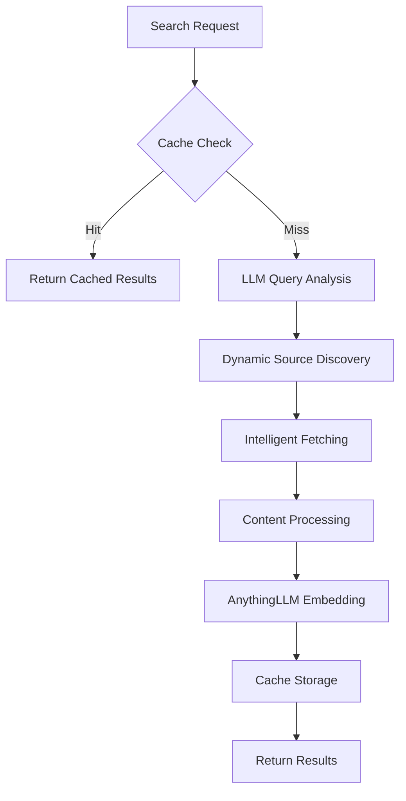

# Full Pipeline Implementation Plan for DocAIche

## Overview
Implement an intelligent documentation search and caching system that uses LLMs extensively to make dynamic decisions about fetching, processing, and serving documentation.

## Pipeline Flow



## Phase 1: LLM-Powered Query Understanding

### 1.1 Implement Smart Query Analyzer
**File**: `src/search/query_analyzer.py`
```python
class LLMQueryAnalyzer:
    async def analyze_query(self, query: str) -> QueryIntent:
        # Use LLM to extract:
        # - Primary technology/framework
        # - Documentation type needed (tutorial, API ref, guide)
        # - Version requirements
        # - Specific features/topics
        # - User expertise level
```

**LLM Prompts**:
- "Analyze this documentation search query and extract: technology, doc type, version, topics, and user level"
- "Identify related technologies that might have relevant documentation"

### 1.2 Technology Detection Enhancement
**File**: `src/enrichment/technology_detector.py`
```python
class LLMTechnologyDetector:
    async def detect_technologies(self, query: str) -> List[TechStack]:
        # Use LLM to:
        # - Identify primary and related technologies
        # - Understand technology relationships
        # - Suggest alternative names/spellings
```

## Phase 2: Dynamic Documentation Discovery

### 2.1 Implement Smart Source Finder
**File**: `src/enrichment/source_discovery.py`
```python
class LLMSourceDiscovery:
    async def discover_sources(self, tech_stack: TechStack) -> List[DocSource]:
        # Use LLM to dynamically find:
        # - Official documentation URLs
        # - GitHub repos with good docs
        # - Community resources
        # - Version-specific docs
```

**LLM Prompts**:
- "For {technology} v{version}, provide official documentation sources including GitHub repos, websites, and direct download links"
- "What are the best documentation sources for learning {topic} in {technology}?"

### 2.2 Source Quality Evaluator
**File**: `src/enrichment/quality_evaluator.py`
```python
class LLMQualityEvaluator:
    async def evaluate_source(self, source: DocSource) -> QualityScore:
        # Use LLM to assess:
        # - Documentation completeness
        # - Update frequency
        # - Community trust
        # - Content accuracy
```

## Phase 3: Intelligent Content Fetching

### 3.1 Fetch Strategy Optimizer
**File**: `src/enrichment/fetch_optimizer.py`
```python
class LLMFetchOptimizer:
    async def optimize_fetch_strategy(self, sources: List[DocSource]) -> FetchPlan:
        # Use LLM to determine:
        # - Best format to fetch (raw markdown, HTML, PDF)
        # - Optimal crawling depth
        # - Rate limiting requirements
        # - Authentication needs
```

### 3.2 Enhanced GitHub Fetcher
**File**: `src/clients/github_enhanced.py`
```python
class EnhancedGitHubClient:
    async def smart_fetch_docs(self, repo: str, query_context: QueryIntent):
        # Use LLM to:
        # - Find documentation in non-standard locations
        # - Identify relevant example code
        # - Determine file importance
```

### 3.3 Web Scraper Enhancement
**File**: `src/clients/smart_scraper.py`
```python
class LLMWebScraper:
    async def intelligent_scrape(self, url: str, context: QueryIntent):
        # Use LLM to:
        # - Extract main content from complex layouts
        # - Identify navigation patterns
        # - Find related pages to crawl
```

## Phase 4: Smart Content Processing

### 4.1 Intelligent Chunking
**File**: `src/document_processing/smart_chunking.py`
```python
class LLMChunker:
    async def smart_chunk(self, content: str, context: QueryIntent):
        # Use LLM to:
        # - Identify semantic boundaries
        # - Preserve code block integrity
        # - Maintain context relationships
        # - Optimize chunk size for retrieval
```

### 4.2 Metadata Enrichment
**File**: `src/document_processing/metadata_enricher.py`
```python
class LLMMetadataEnricher:
    async def enrich_metadata(self, chunk: DocumentChunk):
        # Use LLM to add:
        # - Topic tags
        # - Difficulty level
        # - Prerequisites
        # - Related concepts
```

## Phase 5: AnythingLLM Integration

### 5.1 Workspace Manager
**File**: `src/clients/anythingllm_enhanced.py`
```python
class EnhancedAnythingLLMClient:
    async def smart_workspace_management(self, content: ProcessedDoc):
        # Use LLM to:
        # - Determine optimal workspace organization
        # - Create workspace if needed
        # - Tag documents intelligently
```

### 5.2 Embedding Optimizer
**File**: `src/ingestion/embedding_optimizer.py`
```python
class LLMEmbeddingOptimizer:
    async def optimize_for_embedding(self, content: str):
        # Use LLM to:
        # - Enhance content for better embeddings
        # - Add contextual information
        # - Normalize terminology
```

## Phase 6: Intelligent Retrieval

### 6.1 Query Enhancement
**File**: `src/search/query_enhancer.py`
```python
class LLMQueryEnhancer:
    async def enhance_search_query(self, original: str, context: UserContext):
        # Use LLM to:
        # - Expand query with synonyms
        # - Add technical context
        # - Include related terms
```

### 6.2 Result Re-ranking
**File**: `src/search/result_ranker.py`
```python
class LLMResultRanker:
    async def rerank_results(self, results: List[SearchResult], query: str):
        # Use LLM to:
        # - Assess relevance beyond vector similarity
        # - Consider user intent
        # - Prioritize by usefulness
```

## Implementation Steps

### Week 1: Foundation
1. **Day 1-2**: Implement LLM Query Analyzer
   - Create query analysis prompts
   - Build intent extraction logic
   - Test with various query types

2. **Day 3-4**: Build Dynamic Source Discovery
   - Create source finding prompts
   - Implement GitHub/web source detection
   - Add source quality evaluation

3. **Day 5-7**: Enhance Fetching Logic
   - Implement smart GitHub fetching
   - Add intelligent web scraping
   - Create fetch optimization logic

### Week 2: Processing & Storage
1. **Day 8-9**: Smart Content Processing
   - Build LLM-powered chunker
   - Add metadata enrichment
   - Create quality assessment

2. **Day 10-11**: AnythingLLM Integration
   - Implement workspace management
   - Add embedding optimization
   - Create document upload pipeline

3. **Day 12-14**: Search Enhancement
   - Build query enhancer
   - Implement result re-ranking
   - Add feedback loop

### Week 3: Testing & Optimization
1. **Day 15-16**: End-to-End Testing
   - Test full pipeline flow
   - Measure cache performance
   - Validate LLM decisions

2. **Day 17-18**: Performance Tuning
   - Optimize LLM calls
   - Implement caching strategies
   - Add parallel processing

3. **Day 19-21**: Production Readiness
   - Add monitoring
   - Implement error recovery
   - Create admin tools

## Key LLM Integration Points

### 1. Query Understanding
```python
prompt = f"""
Analyze this documentation search query: "{query}"

Extract:
1. Primary technology/framework
2. Specific version (if mentioned)
3. Documentation type (tutorial/reference/guide)
4. Key topics/features
5. User expertise level (beginner/intermediate/advanced)
6. Related technologies that might be relevant

Return as JSON.
"""
```

### 2. Source Discovery
```python
prompt = f"""
For {technology} documentation about {topic}:

Find the best documentation sources:
1. Official documentation URL
2. GitHub repository with docs
3. Direct download links for offline docs
4. Alternative documentation sites
5. Version-specific documentation

Include quality indicators for each source.
"""
```

### 3. Content Processing
```python
prompt = f"""
This documentation chunk is about {topic} in {technology}.

Analyze and provide:
1. Main concepts covered
2. Difficulty level
3. Prerequisites needed
4. Related topics
5. Best search keywords
6. Suggested chunk boundaries

Help optimize for search retrieval.
"""
```

## Success Metrics

1. **Cache Hit Rate**: Target 70%+ after initial population
2. **Query Understanding Accuracy**: 90%+ correct technology detection
3. **Documentation Coverage**: 95%+ of requested docs found
4. **Processing Speed**: < 5 seconds for cached, < 30 seconds for new
5. **Relevance Score**: 85%+ user satisfaction

## Configuration Requirements

### Environment Variables
```bash
# LLM Configuration
OLLAMA_MODEL=llama3.3:latest
OLLAMA_CONTEXT_SIZE=128000
OPENAI_API_KEY=<for-fallback>

# Processing Configuration
MAX_CONCURRENT_FETCHES=5
CHUNK_SIZE_TOKENS=1000
EMBEDDING_BATCH_SIZE=10

# Cache Configuration
CACHE_TTL_DAYS=30
MAX_CACHE_SIZE_GB=50
```

### Database Schema Updates
```sql
-- Add tables for LLM decision tracking
CREATE TABLE llm_decisions (
    decision_id TEXT PRIMARY KEY,
    query_id TEXT,
    decision_type TEXT,
    llm_model TEXT,
    prompt TEXT,
    response TEXT,
    confidence_score REAL,
    execution_time_ms INTEGER,
    created_at TIMESTAMP
);

-- Add query intent storage
CREATE TABLE query_intents (
    query_id TEXT PRIMARY KEY,
    original_query TEXT,
    detected_technology TEXT,
    doc_type TEXT,
    version_requirement TEXT,
    topics JSON,
    user_level TEXT,
    created_at TIMESTAMP
);
```

## Testing Strategy

### 1. Unit Tests
- Test each LLM prompt for consistency
- Validate parsing of LLM responses
- Test fallback mechanisms

### 2. Integration Tests
- Full pipeline flow tests
- Cache hit/miss scenarios
- Error recovery tests

### 3. Load Tests
- Concurrent query handling
- LLM rate limiting
- Cache performance under load

### 4. User Acceptance Tests
- Real documentation searches
- Relevance validation
- Response time measurement

## Next Steps

1. Start with implementing the LLM Query Analyzer
2. Create test cases for common documentation searches
3. Build the dynamic source discovery system
4. Implement intelligent fetching strategies
5. Test with real documentation sources

This plan leverages LLMs to handle the complexity of:
- Understanding user intent
- Finding documentation dynamically
- Making intelligent fetching decisions
- Processing content optimally
- Enhancing search results

The system will be truly intelligent, adapting to new documentation sources and formats without hardcoded rules.