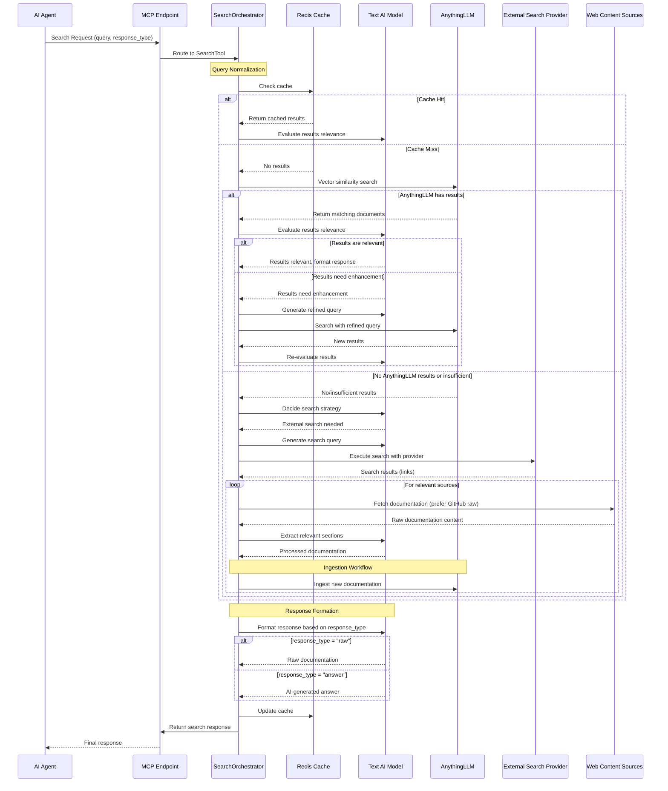

```mermaid
sequenceDiagram
    participant Agent as AI Agent
    participant MCP as MCP Endpoint
    participant SO as SearchOrchestrator
    participant Cache as Redis Cache
    participant AI as Text AI Model
    participant ALLM as AnythingLLM
    participant Search as External Search Provider
    participant Web as Web Content Sources
    
    Agent->>MCP: Search Request (query, response_type)
    MCP->>SO: Route to SearchTool
    
    Note over SO: Query Normalization
    SO->>Cache: Check cache
    
    alt Cache Hit
        Cache-->>SO: Return cached results
        SO->>AI: Evaluate results relevance
        
    else Cache Miss
        Cache-->>SO: No results
        SO->>ALLM: Vector similarity search
        
        alt AnythingLLM has results
            ALLM-->>SO: Return matching documents
            SO->>AI: Evaluate results relevance
            
            alt Results are relevant
                AI-->>SO: Results relevant, format response
            else Results need enhancement
                AI-->>SO: Results need enhancement
                SO->>AI: Generate refined query
                SO->>ALLM: Search with refined query
                ALLM-->>SO: New results
                SO->>AI: Re-evaluate results
            end
            
        else No AnythingLLM results or insufficient
            ALLM-->>SO: No/insufficient results
            SO->>AI: Decide search strategy
            AI-->>SO: External search needed
            SO->>AI: Generate search query
            SO->>Search: Execute search with provider
            Search-->>SO: Search results (links)
            
            loop For relevant sources
                SO->>Web: Fetch documentation (prefer GitHub raw)
                Web-->>SO: Raw documentation content
                SO->>AI: Extract relevant sections
                AI-->>SO: Processed documentation
                
                Note over SO,ALLM: Ingestion Workflow
                SO->>ALLM: Ingest new documentation
            end
        end
    end
    
    Note over SO,AI: Response Formation
    SO->>AI: Format response based on response_type
    
    alt response_type = "raw"
        AI-->>SO: Raw documentation
    else response_type = "answer"
        AI-->>SO: AI-generated answer
    end
    
    SO->>Cache: Update cache
    SO->>MCP: Return search response
    MCP-->>Agent: Final response
```