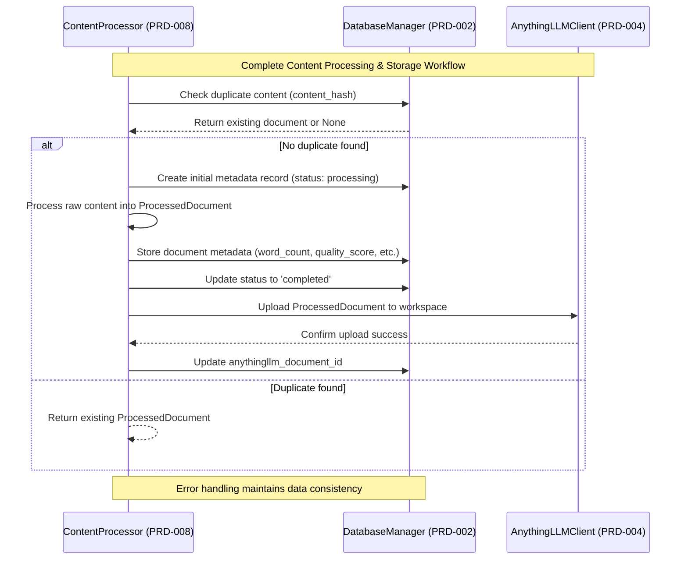

# PRD-008: Content Processing Pipeline

## Overview
Specifies the content processing pipeline. Responsible for transforming raw content (markdown from GitHub or ScrapedContent) into a standardized, chunked, and analyzable format for storage.

## Technical Boundaries
- Pure data transformation utility.
- Called by Content Acquisition Engine.
- No external dependencies; all operations in memory.

## Success Criteria
- Consistently transforms raw content into clean, structured DocumentChunk objects.
- Chunking algorithm splits large documents while preserving context.
- Accurate metadata extraction.

## Dependencies
| Component/PRD | Purpose |
|---------------|---------|
| PRD-003: Configuration Management | Loads content processing config |
| PRD-006: GitHub Repository Client | Provides FileContent for processing |
| PRD-007: Web Scraping Client | Provides ScrapedContent for processing |
| PRD-002: Database & Caching Layer | Stores processed content metadata |
| PRD-004: AnythingLLM Integration | Uploads processed documents |

## Cross-References
- Uses [`ContentConfig`](PRD-003_Config_Mgmt_System.md) from [Configuration Management](PRD-003_Config_Mgmt_System.md) for chunk size limits and processing parameters.
- Receives input from [GitHub Repository Client](PRD-006_Github_repo_client.md) and [Web Scraping Client](PRD-007_web_scraping_client.md).
- Outputs canonical models from [Database & Caching Layer](PRD-002_DB_and_Caching_Layer.md) to [AnythingLLM Integration](PRD-004_AnythingLLM_Integration.md).
- Integrates with [`DatabaseManager`](PRD-002_DB_and_Caching_Layer.md:244) for content persistence.
- Uses [`content_metadata`](PRD-002_DB_and_Caching_Layer.md:58) table for storage workflow.

## Pipeline Interface

```python
from typing import List, Union, Optional, Tuple
from pydantic import BaseModel, Field
from .db_models import DatabaseManager, ProcessedDocument, DocumentMetadata, DocumentChunk

class ContentProcessor:
    def __init__(self, config: ContentConfig, db_manager: DatabaseManager):
        self.chunk_size_default = config.chunk_size_default  # 1000 chars
        self.chunk_size_max = config.chunk_size_max  # 4000 chars
        self.chunk_overlap = config.chunk_overlap  # 100 chars
        self.quality_threshold = config.quality_threshold  # 0.3
        self.db_manager = db_manager  # Database integration
    
    def process_document(self, raw_content: Union[FileContent, ScrapedContent], technology: str) -> Optional[ProcessedDocument]:
        """
        Process raw content into standardized, chunked format.
        
        Chunk Size Specifications:
        - Default chunk size: 1000 characters
        - Maximum chunk size: 4000 characters
        - Overlap between chunks: 100 characters
        - Minimum quality threshold: 0.3
        
        Returns canonical ProcessedDocument from PRD-002
        """
        pass
    
    async def process_and_store_document(
        self,
        raw_content: Union[FileContent, ScrapedContent],
        technology: str
    ) -> Tuple[Optional[ProcessedDocument], str]:
        """
        Complete integration workflow: process content and persist to database.
        
        Integration with PRD-002:
        - Uses DatabaseManager for all database operations
        - Stores metadata in content_metadata table
        - Implements deduplication via content_hash checks
        - Tracks processing_status throughout workflow
        - Provides comprehensive error handling and recovery
        
        Returns:
            Tuple of (ProcessedDocument if successful, status_message)
        """
        pass

# All data models are canonical models from PRD-002:
# - ProcessedDocument: Complete document with metadata and chunks
# - DocumentChunk: Individual content chunk with versioning
# - DocumentMetadata: Document metadata with creation timestamps
#
# Import Note: Models are imported from .db_models module which provides
# the canonical data structures defined in PRD-002. This ensures consistent
# data contracts across all components that interact with the database layer.
```

## Content Processing Configuration

```python
class ContentConfig(BaseModel):
    chunk_size_default: int = Field(1000, description="Default chunk size in characters")
    chunk_size_max: int = Field(4000, description="Maximum chunk size in characters")
    chunk_overlap: int = Field(100, description="Character overlap between chunks")
    quality_threshold: float = Field(0.3, ge=0.0, le=1.0, description="Minimum quality score")
    min_content_length: int = Field(50, description="Minimum content length to process")
    max_content_length: int = Field(1000000, description="Maximum content length to process")
```

## Implementation Tasks

| Task ID | Description |
|---------|-------------|
| CP-001  | Implement ContentProcessor and process_document method |
| CP-002  | Implement normalization stage (string manipulation, regex) |
| CP-003  | Implement metadata extraction (word count, hash, etc.) |
| CP-004  | Implement initial quality scoring algorithm |
| CP-005  | Implement chunking algorithm (manual or with library) |
| CP-006  | Package results into ProcessedDocument model |
| CP-007  | Implement filtering logic for low-quality/short content |
| CP-008  | Write unit tests for chunking algorithm |
| CP-009  | Write unit tests for quality scoring heuristics |
| CP-010  | Ensure Unicode handling in all text processing |
| **CP-011** | **Implement database integration with process_and_store_document method** |
| **CP-012** | **Implement content deduplication checks via content_hash** |
| **CP-013** | **Implement processing status tracking and updates** |
| **CP-014** | **Implement error handling patterns for database operations** |
| **CP-015** | **Implement transactional processing with rollback capabilities** |
| **CP-016** | **Create database method signatures for metadata storage** |
| **CP-017** | **Implement cleanup procedures for failed processing** |
| **CP-018** | **Write integration tests for database workflow** |
| **CP-019** | **Implement content similarity checks for advanced deduplication** |
| **CP-020** | **Create monitoring and logging for processing pipeline** |

## Database Integration Workflow

### Content Storage Lifecycle

```python
from typing import Optional, Tuple
from .db_models import DatabaseManager, ProcessedDocument, DocumentMetadata

class ContentProcessor:
    def __init__(self, config: ContentConfig, db_manager: DatabaseManager):
        self.config = config
        self.db_manager = db_manager
    
    async def process_and_store_document(
        self,
        raw_content: Union[FileContent, ScrapedContent],
        technology: str
    ) -> Tuple[Optional[ProcessedDocument], str]:
        """
        Complete workflow: process content and persist to database.
        
        Returns:
            Tuple of (ProcessedDocument if successful, status_message)
            
        Database Integration Points:
        1. Check for existing content via content_hash
        2. Process raw content into ProcessedDocument
        3. Store metadata in content_metadata table
        4. Update processing_status throughout workflow
        5. Handle deduplication and error recovery
        """
        try:
            # Step 1: Check for duplicate content
            content_hash = self._compute_content_hash(raw_content.content)
            existing_doc = await self._check_duplicate_content(content_hash)
            if existing_doc:
                return existing_doc, "duplicate_content_found"
            
            # Step 2: Create initial metadata record with 'processing' status
            content_id = self._generate_content_id(raw_content.source_url, technology)
            await self._create_initial_metadata_record(content_id, raw_content, technology, content_hash)
            
            # Step 3: Process content into ProcessedDocument
            processed_doc = self.process_document(raw_content, technology)
            if not processed_doc:
                await self._update_processing_status(content_id, "failed", "processing_failed")
                return None, "processing_failed"
            
            # Step 4: Store processed document metadata
            await self._store_document_metadata(processed_doc)
            
            # Step 5: Update status to completed
            await self._update_processing_status(content_id, "completed")
            
            return processed_doc, "success"
            
        except Exception as e:
            await self._handle_processing_error(content_id, e)
            return None, f"error: {str(e)}"
```

### Database Method Signatures

```python
async def _check_duplicate_content(self, content_hash: str) -> Optional[ProcessedDocument]:
    """
    Check if content already exists in database.
    
    Database Query:
        SELECT * FROM content_metadata WHERE content_hash = ?
        
    Returns:
        ProcessedDocument if found, None otherwise
    """
    query = "SELECT * FROM content_metadata WHERE content_hash = ?"
    result = await self.db_manager.fetch_one(query, (content_hash,))
    if result:
        return await self.db_manager.load_processed_document_from_metadata(result)
    return None

async def _create_initial_metadata_record(
    self,
    content_id: str,
    raw_content: Union[FileContent, ScrapedContent],
    technology: str,
    content_hash: str
) -> None:
    """
    Create initial record in content_metadata table with 'processing' status.
    
    Database Insert:
        INSERT INTO content_metadata (content_id, title, source_url, technology,
                                    content_hash, processing_status, created_at)
        VALUES (?, ?, ?, ?, ?, 'processing', CURRENT_TIMESTAMP)
    """
    query = """
        INSERT INTO content_metadata
        (content_id, title, source_url, technology, content_hash, processing_status, created_at)
        VALUES (?, ?, ?, ?, ?, 'processing', CURRENT_TIMESTAMP)
    """
    title = getattr(raw_content, 'title', '') or self._extract_title_from_url(raw_content.source_url)
    params = (content_id, title, raw_content.source_url, technology, content_hash)
    await self.db_manager.execute(query, params)

async def _store_document_metadata(self, processed_doc: ProcessedDocument) -> None:
    """
    Update content_metadata table with processing results.
    
    Database Update:
        UPDATE content_metadata SET
            word_count = ?, heading_count = ?, code_block_count = ?,
            chunk_count = ?, quality_score = ?, updated_at = CURRENT_TIMESTAMP
        WHERE content_id = ?
    """
    query = """
        UPDATE content_metadata SET
            word_count = ?, heading_count = ?, code_block_count = ?,
            chunk_count = ?, quality_score = ?, updated_at = CURRENT_TIMESTAMP
        WHERE content_id = ?
    """
    params = (
        processed_doc.metadata.word_count,
        processed_doc.metadata.heading_count,
        processed_doc.metadata.code_block_count,
        len(processed_doc.chunks),
        processed_doc.quality_score,
        processed_doc.id
    )
    await self.db_manager.execute(query, params)

async def _update_processing_status(
    self,
    content_id: str,
    status: str,
    error_message: Optional[str] = None
) -> None:
    """
    Update processing_status in content_metadata table.
    
    Valid statuses: 'pending', 'processing', 'completed', 'failed', 'flagged'
    
    Database Update:
        UPDATE content_metadata SET processing_status = ?, updated_at = CURRENT_TIMESTAMP
        WHERE content_id = ?
    """
    query = "UPDATE content_metadata SET processing_status = ?, updated_at = CURRENT_TIMESTAMP WHERE content_id = ?"
    await self.db_manager.execute(query, (status, content_id))
    
    if error_message:
        # Log error for debugging (could extend to error_logs table if needed)
        logger.error(f"Processing failed for {content_id}: {error_message}")
```

### Error Handling Patterns

```python
async def _handle_processing_error(self, content_id: str, error: Exception) -> None:
    """
    Comprehensive error handling for processing failures.
    
    Error Recovery Patterns:
    1. Update processing_status to 'failed'
    2. Log detailed error information
    3. Determine if error is retryable
    4. Clean up partial processing artifacts
    """
    try:
        await self._update_processing_status(content_id, "failed")
        
        # Log with structured error data
        logger.error(
            "Content processing failed",
            extra={
                "content_id": content_id,
                "error_type": type(error).__name__,
                "error_message": str(error),
                "retryable": self._is_retryable_error(error)
            }
        )
        
        # Clean up any partial artifacts
        await self._cleanup_partial_processing(content_id)
        
    except Exception as cleanup_error:
        logger.critical(f"Failed to handle processing error for {content_id}: {cleanup_error}")

def _is_retryable_error(self, error: Exception) -> bool:
    """
    Determine if processing error is retryable.
    
    Retryable errors:
    - Network timeouts
    - Temporary database connection issues
    - Memory pressure (for large documents)
    
    Non-retryable errors:
    - Invalid content format
    - Content quality below threshold
    - Malformed input data
    """
    retryable_types = (
        ConnectionError,
        TimeoutError,
        MemoryError,
    )
    return isinstance(error, retryable_types)

async def _cleanup_partial_processing(self, content_id: str) -> None:
    """
    Clean up any partial processing artifacts.
    
    Cleanup tasks:
    1. Remove any temporary files
    2. Clear partial cache entries
    3. Reset processing counters
    """
    # Implementation would clean up temporary artifacts
    pass
```

### Content Deduplication Workflow

```python
async def _perform_deduplication_check(
    self,
    content_hash: str,
    source_url: str,
    technology: str
) -> Optional[str]:
    """
    Advanced deduplication check beyond simple hash comparison.
    
    Deduplication Strategy:
    1. Exact content hash match (primary)
    2. Similar source URL with same technology
    3. Content similarity threshold check
    
    Returns:
        content_id of existing document if duplicate found, None otherwise
    """
    # Primary check: exact content hash
    exact_match = await self._check_duplicate_content(content_hash)
    if exact_match:
        return exact_match.id
    
    # Secondary check: similar source URLs
    similar_query = """
        SELECT content_id, source_url FROM content_metadata
        WHERE technology = ? AND processing_status = 'completed'
        ORDER BY created_at DESC LIMIT 100
    """
    similar_docs = await self.db_manager.fetch_all(similar_query, (technology,))
    
    for doc in similar_docs:
        if self._urls_are_similar(source_url, doc['source_url']):
            return doc['content_id']
    
    return None

def _urls_are_similar(self, url1: str, url2: str) -> bool:
    """
    Check if two URLs represent the same content source.
    
    Similarity checks:
    - Same domain and path (ignoring query params)
    - GitHub repo with different commit/branch refs
    - Versioned documentation URLs
    """
    # Implementation would use URL parsing and similarity logic
    pass
```

## Integration Contracts
- Accepts FileContent or ScrapedContent as input.
- Returns a validated ProcessedDocument or None.
- Handles empty or malformed content gracefully.
- **Database Integration**: Uses [`DatabaseManager`](PRD-002_DB_and_Caching_Layer.md:244) for all persistence operations.
- **Error Recovery**: Implements transactional processing with rollback capabilities.
- **Deduplication**: Prevents duplicate content storage via hash-based and similarity checks.
- **Status Tracking**: Maintains processing_status throughout workflow for monitoring and debugging.

## Summary Tables

### Methods Table

| Method Name                | Description                                   | Returns                                    |
|----------------------------|-----------------------------------------------|--------------------------------------------|
| process_document           | Runs full pipeline on raw content            | ProcessedDocument                          |
| **process_and_store_document** | **Complete workflow with database integration** | **Tuple[ProcessedDocument, status_message]** |
| **_check_duplicate_content**   | **Check for existing content via hash**      | **Optional[ProcessedDocument]**           |
| **_create_initial_metadata_record** | **Create processing record in database** | **None**                                  |
| **_store_document_metadata**    | **Store processed document metadata**       | **None**                                  |
| **_update_processing_status**   | **Update processing status in database**    | **None**                                  |
| **_handle_processing_error**    | **Handle and log processing failures**      | **None**                                  |

### Data Models Table

| Model Name        | Description                       | Used In Method(s)                |
|-------------------|-----------------------------------|----------------------------------|
| DocumentMetadata  | Metadata for processed content    | process_document, _store_document_metadata |
| DocumentChunk     | Chunk of processed content        | process_document                 |
| ProcessedDocument | Full processed document           | process_document, process_and_store_document |
| **DatabaseManager** | **Database access layer from PRD-002** | **All database integration methods** |

### Implementation Tasks Table
(see Implementation Tasks above)

## Complete Integration Data Flow

### PRD-008 → PRD-002 → PRD-004 Workflow



### Integration Points Summary

| Integration Point | PRD-008 Method | PRD-002 Component | PRD-004 Method | Data Contract |
|-------------------|-----------------|-------------------|----------------|---------------|
| **Content Storage** | `_store_document_metadata()` | `content_metadata` table | - | ProcessedDocument metadata |
| **Deduplication** | `_check_duplicate_content()` | DatabaseManager.fetch_one() | - | content_hash lookup |
| **Status Tracking** | `_update_processing_status()` | DatabaseManager.execute() | - | processing_status updates |
| **Document Upload** | `process_and_store_document()` | - | `upload_document()` | Complete ProcessedDocument |
| **Error Recovery** | `_handle_processing_error()` | DatabaseManager.execute() | - | Status rollback to 'failed' |

### Cross-PRD Method Signatures

**PRD-008 calling PRD-002:**
```python
# Content deduplication
existing_doc = await db_manager.fetch_one(
    "SELECT * FROM content_metadata WHERE content_hash = ?",
    (content_hash,)
)

# Metadata storage
await db_manager.execute(
    "UPDATE content_metadata SET word_count = ?, quality_score = ? WHERE content_id = ?",
    (doc.metadata.word_count, doc.quality_score, doc.id)
)
```

**PRD-008 output to PRD-004:**
```python
# Document upload after processing
upload_result = await anythingllm_client.upload_document(
    workspace_slug="technology-docs",
    document=processed_document  # ProcessedDocument from PRD-002 canonical models
)
```

### Error Handling Integration

**Database Transaction Patterns:**
```python
async def process_and_store_document(self, raw_content, technology):
    async with self.db_manager.transaction():
        try:
            # Step 1: Create processing record
            await self._create_initial_metadata_record(...)
            
            # Step 2: Process content
            processed_doc = self.process_document(raw_content, technology)
            
            # Step 3: Store results
            await self._store_document_metadata(processed_doc)
            
            # Step 4: Update status to completed
            await self._update_processing_status(content_id, "completed")
            
            return processed_doc, "success"
            
        except Exception as e:
            # Transaction auto-rollback on exception
            await self._update_processing_status(content_id, "failed")
            raise
```

---