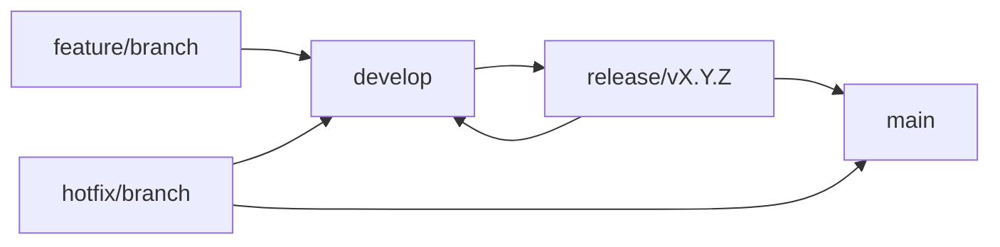

# Git Workflow Standards

## Overview
This document defines the Git workflow, branching strategy, and commit standards for the DocAIche project. These standards ensure consistent collaboration, clear history, and reliable deployments.

## Branching Strategy

### Branch Types
We use a modified GitFlow strategy optimized for continuous delivery:

```
main (production)
├── develop (integration)
├── feature/JIRA-123-user-authentication
├── feature/JIRA-456-search-optimization
├── hotfix/JIRA-789-security-patch
├── release/v2.1.0
└── bugfix/JIRA-321-search-results-fix
```

### Branch Naming Convention
- **main**: Production-ready code, always deployable
- **develop**: Integration branch for features, deployed to staging
- **feature/[TICKET-ID]-[description]**: New features and enhancements
- **bugfix/[TICKET-ID]-[description]**: Non-critical bug fixes
- **hotfix/[TICKET-ID]-[description]**: Critical production fixes
- **release/v[X.Y.Z]**: Release preparation branches
- **chore/[description]**: Maintenance tasks (dependency updates, etc.)

### Branch Protection Rules

#### Main Branch
- **MUST** require pull request reviews (minimum 2 approvers)
- **MUST** require status checks to pass
- **MUST** require branches to be up to date before merging
- **MUST** require signed commits
- **MUST NOT** allow force pushes
- **MUST NOT** allow deletions

#### Develop Branch
- **MUST** require pull request reviews (minimum 1 approver)
- **MUST** require status checks to pass
- **SHOULD** require branches to be up to date before merging
- **MUST NOT** allow force pushes

## Commit Standards

### Commit Message Format
```
<type>(<scope>): <subject>

<body>

<footer>
```

### Commit Types
- **feat**: New feature for the user
- **fix**: Bug fix for the user
- **docs**: Documentation changes
- **style**: Formatting, missing semicolons, etc. (no code change)
- **refactor**: Code refactoring (no functional changes)
- **perf**: Performance improvements
- **test**: Adding or updating tests
- **chore**: Build tasks, dependency updates, etc.
- **security**: Security-related changes
- **breaking**: Breaking changes (should be rare)

### Commit Scope (Optional)
- **auth**: Authentication/authorization
- **api**: API endpoints
- **ui**: User interface
- **db**: Database-related
- **config**: Configuration changes
- **deploy**: Deployment-related
- **docs**: Documentation
- **test**: Testing

### Examples
```bash
feat(auth): implement JWT refresh token mechanism

Add refresh token support to extend user sessions securely.
- Generate refresh tokens with 7-day expiry
- Implement token rotation on refresh
- Add blacklist mechanism for revoked tokens

Closes JIRA-123
```

```bash
fix(api): handle empty search query gracefully

The search endpoint now returns a proper error message when 
the query parameter is empty or contains only whitespace.

Fixes JIRA-456
```

```bash
security(auth): upgrade bcrypt to fix vulnerability CVE-2023-1234

Update bcrypt library to version 4.0.1 to address security 
vulnerability in password hashing.

BREAKING CHANGE: Minimum Node.js version is now 16.0.0
```

### Commit Guidelines
- **MUST** use present tense ("add feature" not "added feature")
- **MUST** use imperative mood ("move cursor to..." not "moves cursor to...")
- **MUST** reference ticket numbers (JIRA-123, GitHub issue #123)
- **SHOULD** limit subject line to 50 characters
- **SHOULD** wrap body at 72 characters
- **MUST** separate subject from body with blank line
- **SHOULD** explain what and why vs. how in the body
- **MUST** sign commits with GPG key

## Feature Development Workflow

### 1. Create Feature Branch
```bash
# Ensure you're on the latest develop
git checkout develop
git pull origin develop

# Create and checkout feature branch
git checkout -b feature/JIRA-123-user-authentication

# Push branch to remote
git push -u origin feature/JIRA-123-user-authentication
```

### 2. Development Process
```bash
# Make small, focused commits
git add src/auth/jwt_manager.py
git commit -m "feat(auth): add JWT token generation

Implement JWT access and refresh token generation with
configurable expiration times and secure signing."

# Push commits regularly
git push origin feature/JIRA-123-user-authentication

# Keep feature branch updated with develop
git fetch origin
git rebase origin/develop
```

### 3. Pre-Pull Request Checklist
- [ ] All tests passing locally
- [ ] Code follows style guidelines
- [ ] Security scan passed
- [ ] Documentation updated
- [ ] Commit messages follow standards
- [ ] Branch rebased with latest develop
- [ ] Self-review completed

### 4. Create Pull Request
```markdown
## Summary
Implement JWT authentication system with refresh tokens for enhanced security.

## Changes
- Add JWT token generation and validation
- Implement refresh token mechanism
- Add token blacklist for logout
- Update authentication middleware
- Add comprehensive tests

## Testing
- [ ] Unit tests pass (95% coverage)
- [ ] Integration tests pass
- [ ] Security tests pass
- [ ] Manual testing completed

## Security Considerations
- Uses industry-standard JWT libraries
- Implements secure token rotation
- Adds proper token validation
- Includes rate limiting for auth endpoints

## Breaking Changes
None

## Deployment Notes
- Update environment variables for JWT secrets
- Run database migration for token blacklist table

Closes JIRA-123
```

### 5. Code Review Process
- **Reviewer Assignment**: Automatically assigned based on CODEOWNERS
- **Review Criteria**: See [Code Review Guidelines](./code-review.md)
- **Required Approvals**: Minimum 2 for main, 1 for develop
- **Address Feedback**: Make changes in new commits, don't force push
- **Final Approval**: Squash and merge after all approvals

## Hotfix Workflow

### 1. Critical Production Issue
```bash
# Create hotfix branch from main
git checkout main
git pull origin main
git checkout -b hotfix/JIRA-789-security-patch

# Make minimal fix
git add src/auth/security_fix.py
git commit -m "security(auth): fix authentication bypass vulnerability

Patch authentication middleware to prevent bypass through
malformed headers.

SECURITY: Fixes critical vulnerability CVE-2023-5678"

# Push hotfix
git push -u origin hotfix/JIRA-789-security-patch
```

### 2. Hotfix Deployment
- **Create PR to main**: For immediate production deployment
- **Emergency approval**: Security officer or on-call engineer
- **Deploy immediately**: After merge to main
- **Backport to develop**: Create separate PR to merge into develop

## Release Workflow

### 1. Prepare Release
```bash
# Create release branch from develop
git checkout develop
git pull origin develop
git checkout -b release/v2.1.0

# Update version numbers
npm version 2.1.0  # or manual update
git add package.json
git commit -m "chore(release): bump version to 2.1.0"

# Push release branch
git push -u origin release/v2.1.0
```

### 2. Release Testing
- **Staging deployment**: Deploy release branch to staging
- **QA testing**: Complete test suite execution
- **Performance testing**: Load and stress testing
- **Security testing**: Final security scan
- **User acceptance**: Product owner approval

### 3. Release Deployment
```bash
# Merge to main
git checkout main
git merge --no-ff release/v2.1.0
git tag -a v2.1.0 -m "Release version 2.1.0"
git push origin main --tags

# Backmerge to develop
git checkout develop
git merge --no-ff release/v2.1.0
git push origin develop

# Delete release branch
git branch -d release/v2.1.0
git push origin --delete release/v2.1.0
```

## Branch Management

### Branch Lifecycle


### Automatic Branch Cleanup
```bash
# Delete merged feature branches automatically
git config --global branch.autosetupmerge always
git config --global branch.autosetuprebase always

# Prune remote tracking branches
git config --global fetch.prune true
```

### Branch Protection Automation
```yaml
# .github/branch-protection.yml
protection_rules:
  main:
    required_status_checks:
      strict: true
      contexts:
        - continuous-integration
        - security-scan
        - code-quality
    enforce_admins: true
    required_pull_request_reviews:
      required_approving_review_count: 2
      dismiss_stale_reviews: true
      require_code_owner_reviews: true
    restrictions:
      users: []
      teams: ["core-developers"]
```

## Git Configuration

### Required Git Configuration
```bash
# User configuration
git config --global user.name "Your Name"
git config --global user.email "your.email@company.com"
git config --global user.signingkey YOUR_GPG_KEY_ID

# Commit signing
git config --global commit.gpgsign true
git config --global tag.gpgsign true

# Default branch
git config --global init.defaultBranch main

# Pull strategy
git config --global pull.rebase true

# Push strategy
git config --global push.default current

# Editor
git config --global core.editor "code --wait"  # VS Code
```

### Git Hooks

#### Pre-commit Hook
```bash
#!/bin/sh
# .git/hooks/pre-commit

# Run code formatting
echo "Running code formatters..."
black src/
prettier --write admin-ui/src/

# Run linting
echo "Running linters..."
flake8 src/
eslint admin-ui/src/

# Run security scan
echo "Running security scan..."
bandit -r src/
npm audit --audit-level moderate

# Run unit tests
echo "Running unit tests..."
pytest tests/unit/ --no-cov

if [ $? -ne 0 ]; then
    echo "Tests failed. Commit aborted."
    exit 1
fi
```

#### Commit Message Hook
```bash
#!/bin/sh
# .git/hooks/commit-msg

# Check commit message format
commit_regex='^(feat|fix|docs|style|refactor|perf|test|chore|security|breaking)(\(.+\))?: .{1,50}'

if ! grep -qE "$commit_regex" "$1"; then
    echo "Invalid commit message format!"
    echo "Format: <type>(<scope>): <subject>"
    echo "Example: feat(auth): add JWT authentication"
    exit 1
fi

# Check for ticket reference
if ! grep -qE "(JIRA-[0-9]+|#[0-9]+|Closes|Fixes)" "$1"; then
    echo "Commit message must reference a ticket (JIRA-123 or #123)"
    exit 1
fi
```

## Merge Strategies

### Feature Branches
- **Squash and Merge**: Combines all commits into one clean commit
- **Benefits**: Clean history, single commit per feature
- **Usage**: Default for feature branches to develop

### Release Branches
- **Merge Commit**: Preserves branch history
- **Benefits**: Clear release boundaries in history
- **Usage**: For release branches to main and develop

### Hotfix Branches
- **Fast-forward**: When possible, otherwise merge commit
- **Benefits**: Immediate deployment capability
- **Usage**: Critical fixes that need immediate deployment

## Conflict Resolution

### Merge Conflicts
```bash
# During rebase
git rebase origin/develop

# Resolve conflicts in files
# Then continue rebase
git add resolved-file.py
git rebase --continue

# Or abort if needed
git rebase --abort
```

### Best Practices
- **Frequent syncing**: Rebase feature branches regularly
- **Small commits**: Easier to resolve conflicts
- **Communication**: Coordinate with team on overlapping changes
- **Tools**: Use visual merge tools (VS Code, GitKraken, etc.)

## Repository Maintenance

### Regular Cleanup
```bash
# Clean up merged branches
git branch --merged develop | grep -v "\*\|main\|develop" | xargs -n 1 git branch -d

# Prune remote branches
git remote prune origin

# Garbage collection
git gc --aggressive
```

### Security Measures
- **GPG signing**: All commits must be signed
- **SSH keys**: Use SSH keys for authentication
- **2FA**: Enable two-factor authentication
- **Token management**: Rotate personal access tokens regularly

## Tools and Integration

### Required Tools
- **Git**: Version 2.30+ with GPG support
- **Git LFS**: For large files (design assets, etc.)
- **GitHub CLI**: For automation and PR management
- **Pre-commit**: Automated code quality checks

### IDE Integration
- **VS Code**: GitLens extension for enhanced Git integration
- **IntelliJ**: Built-in Git support with visual merge tools
- **Vim**: fugitive.vim for Git operations

### Automation
- **GitHub Actions**: Automated testing and deployment
- **Dependabot**: Automated dependency updates
- **Branch protection**: Automated enforcement of policies
- **Status checks**: Required CI/CD pipeline success

## Troubleshooting

### Common Issues

#### Accidentally Committed to Wrong Branch
```bash
# Move commits to correct branch
git log --oneline -5  # Note commit hashes
git reset --hard HEAD~3  # Remove last 3 commits
git checkout correct-branch
git cherry-pick commit-hash1 commit-hash2 commit-hash3
```

#### Force Push Recovery
```bash
# Find lost commits
git reflog

# Recover commits
git reset --hard HEAD@{2}  # Or specific commit hash
```

#### Large File Issues
```bash
# Remove large file from history
git filter-branch --force --index-filter \
  'git rm --cached --ignore-unmatch large-file.zip' \
  --prune-empty --tag-name-filter cat -- --all
```

This Git workflow ensures consistent collaboration, maintains code quality, and enables reliable deployments while supporting both continuous delivery and emergency hotfixes.